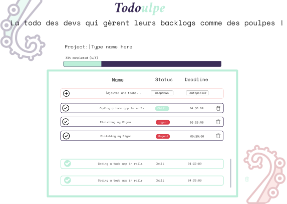
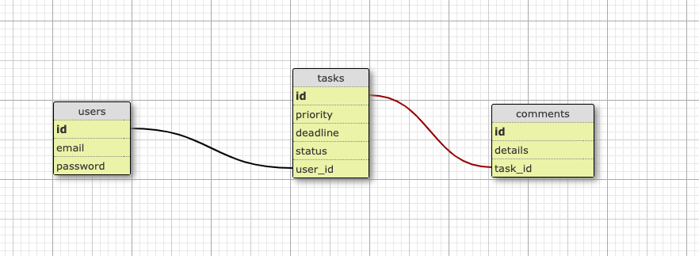

# [Todoulpe Application](https://todoulpe.herokuapp.com/)

Todoulpe is an AJAX todo-like application inspired by Poulpe’s design.
I usually work with Rails only but I thought it would be interesting to implement this project with Vue.js. I first tried this javascript framework last month and I really liked working with it on small projects, it felt like it would work well with Rails.

I used the following technologies:
* Rails
* Vue.js
* Bootstrap
* Devise
* Pundit

## Researches

First, I listed the mandatory actions (user stories) that were asked to be realized for the test: 
* The user needs to be able to sign-in/sign-up with an email and a password;
* The user needs to be able to add/delete a task;
* The user needs to be able to define a priority to the task created;
* The user needs to be able to attribute a deadline to the task;
* The user can mark their task as “Done”;
* The user can add a comment on a task;
* The user can delete a comment;


Then, I started to think about the product I needed to build. I know that todo apps are quite trendy in the tech industry  so I chose to do some discovery on how leaders like Trello, Asana, Notion, Jira, Wunderlist had built theirs.

I defined the project and created a roadmap that I put on Github project [Github project ](https://github.com/junkiesan/todoulpe/projects/1).
There are many todo apps on the market. I knew that if I wanted to stand out among the other candidates I needed to bring a fresh idea on the table. So I brainstormed and it hit me: An Octopus is extremely smart, indeed it has 9 brains and 8 tentacles.
They can do different things at the same time, a bit like a Full-Stack and thus I imagined the name Todouple, a mix of “Todo” and “Poulpe”. 

What about the identity? 
Easy, choosing colors and UI is not my strongest suit so it got me thinking how can I be efficient and create a homogenous experience:  I’m going to use Poulpe’s identity and create a chameleon for my project. 
I did a parallel between the logo, the progress bar and the tasks :
* I chose the blue for what needed to be done so I highlighted in the  “Todo” part of the logo. For the progress bar the blue colour represents what needs to be done as well as the tasks that still need to be done. 
* The greenish highlights what has been done, so “ulpe” on the logo. The green part represents what has been completed as well as the tasks that are done.

I will deliver the product with a mock login already made up and a list of all users’ stories I needed to complete for the test.

[Here is the link to the figma:](https://www.figma.com/file/QYftIdEte7uYYGtIsM6bYb/Todoulpe?node-id=0%3A1)
* a sign-in page
* a sign-up page
* Todoulpe’s main page; When the user clicks on a task, a modal opens and they can leave a comment.




Then I thought about the relational database using postgresql.
Using Devise I had to create three tables. The Users’ one having many Tasks and having many Comments through Tasks.
The Tasks one belonging to the User and having many Comments and the Comments table belonging to Task.



## Initialisation

First I had to create the project while setting a postgresql database.

```
rails new todoulpe -d=postgresql
```

## Configuration

### Devise

The purpose of the Devise gem goal is to create an authentication logic. Once the gem is installed in the bundler, it permits to generate the Devise’s User table and views.
I tested the authentication logic and secured the routes with the callback authenticate_user!. 

### Pundit

The purpose of the Pundit gem goal is to manage authorisation inside your app. I added it to the bundler and then generated a basic policy letting the more complicated part for the creation of the other tables.

### Rspec

Rspec gem goal is to test your rails’ files. For this project I first deleted the basic tests generated automatically by rails and installed the basic Spec template.


## Active Record

### Tasks

Task has a title as a string, a priority as a string, a deadline as a date, a status as a boolean and a user_id as a foreign key.

Inside the model the idea is to validate the fact that the title is present, priority is equal to one of the three strings of the linked array, status is by default false and the deadline can be expired.

The controller logic is to make a CRUD that renders json/html for every action and route as GET, POST, PATCH, DELETE. I created some views to test all the methods of the controller. 

### Comments

Comment is defined by details, a text, and a task_id, a foreign key. It belongs to task so it should only be available on the task.

The logic is kind of the same as the task for rendering the json/html and a comment must be at least 30 characters long.

## Testing

I tested with Rspec the CRUD actions for a task and a comment. The show action couldn’t match with the test because of the timestamps.
Then I tested if each class could create an object while respecting all the validations.

## Authorisation

Pundit allows to generate policies for our controllers. To make sure each user has the rights to make each action, rules must be established.

## Production

The project is hosted on Heroku, a product that I often use on other rails apps.
The page loading can be long because I didn’t allow dynos for it.

## Vue.js

I implemented this javascript framework because I like working with it and I wanted to try to connect it with a rails app. Vue.js is a really pleasant to use and is adapted to this kind of project. Basic actions were created while connecting the database. I couldn’t go further because of the lack of time.

## [incomplete] Front-end 

I need to do some integrations for the homepage and the sign-in/sign-up pages, in a kawai style because I love Japan.

## [incomplete] Github Actions

It could be great to implement some continuous integration with Github Actions like auto deployment on Heroku and automatised tests.

## Installation

For it's first launch run the following command :

```
bundle install
```

Create the db

```
rails db:create
```
Then run the migrations

```
rails db:migrate
```

## Contributions

Pull requests are welcome. For major changes, please open an issue first to discuss what you would like to change.


## Where I got stuck

I hesitated a lot for the stack I would use for this test but I thought it would be more interesting and challenging to implement this project with Vue.js and discover a new part of this framework.
With this in mind I had to try to create this project using Rails for the back-end and Vue.js for the front-end, it would be the biggest challenge here.
The Rails part was doing great but when the time to link it to Vue.js had come, I started being stuck on persisting data from the database. 
The first time I tried to implement axios, after a sympathetic failure I succeeded while loading json on my view and using it as props in my Vue app.
Then I had problems using AJAX inside Vue.js I looked for a lot of documentation and explanations on Medium for example and succeeded in doing some actions. 
While being stuck in these situations I would have definitely benefited from an external point of view that would have significantly saved some time on a few parts that were challenging but not insurmountable. I’m used to coding on my own and doing things my way but I realised I would have been more efficient with the right pointers.
I haven’t found a lot of documentation on connecting Rails and Vue, my theory is that this stack is mostly used by Saas and they solve their bugs by themselves.

## what I’d like to improve & learn

* I would love to start learning GraphQL with this project. I think it could have been the perfect opportunity. 
* We could add a Projects table to make it a joint table between users and tasks
* Permit other users to comment tasks
* Find a way to customize a progress bar
* Create tests for all user stories
* Refacto my code on Vue.js in components
* Add modale with the cute poulpe
* Cleaning and improving my code
